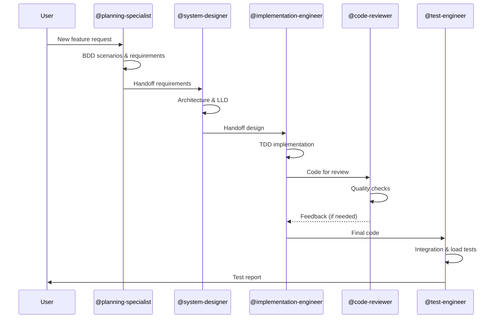
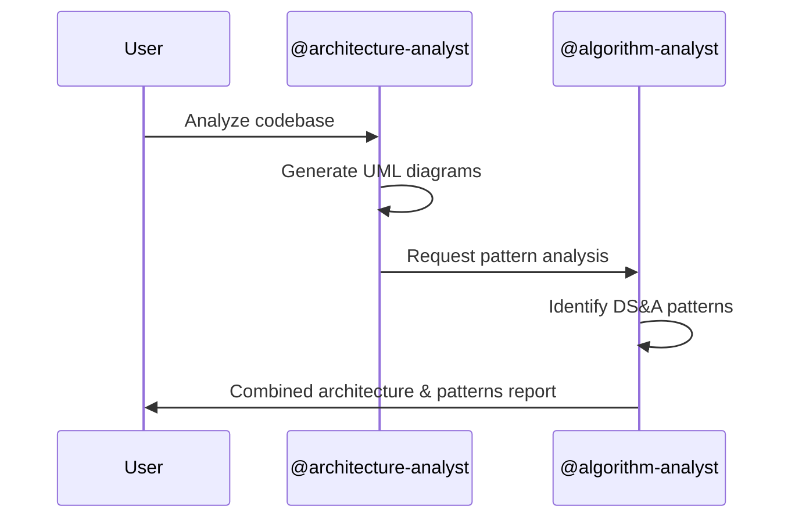

# Repository Copilot Standards - TheAlgorithms/Java

This document defines the GitHub Copilot configuration for the Java Algorithms educational repository.

## Repository Overview

| Attribute | Value |
|-----------|-------|
| **Project Type** | Educational Algorithm Library |
| **Language** | Java 21 |
| **Build System** | Apache Maven |
| **Package Root** | `com.thealgorithms` |

## Active Agents

The following agents have been generated based on codebase analysis:

| Agent | Purpose | Invoke With |
|-------|---------|-------------|
| @architecture-analyst | Extract architecture diagrams (C4, UML, PlantUML) | `@architecture-analyst` |
| @algorithm-analyst | Analyze DS&A patterns, pitfalls, recommendations | `@algorithm-analyst` |
| @planning-specialist | BDD/SOLID/KISS feature planning | `@planning-specialist` |
| @system-designer | High/low-level system design | `@system-designer` |
| @implementation-engineer | TDD-based code implementation | `@implementation-engineer` |
| @code-reviewer | Quality checks (Checkstyle, SpotBugs, PMD, Snyk) | `@code-reviewer` |
| @test-engineer | Unit, integration, load testing | `@test-engineer` |

## Topology

Using **Mesh Topology** structure for agent collaboration.

**Rationale:** This is a single-module educational repository with clear separation of concerns. Agents can collaborate directly without hierarchical coordination:

```
                    ┌─────────────────────┐
                    │  Planning           │
                    │  Specialist         │
                    └──────────┬──────────┘
                               │
         ┌─────────────────────┼─────────────────────┐
         │                     │                     │
         ▼                     ▼                     ▼
┌─────────────────┐   ┌─────────────────┐   ┌─────────────────┐
│  Architecture   │◄──│     System      │──►│  Algorithm      │
│  Analyst        │   │    Designer     │   │  Analyst        │
└────────┬────────┘   └────────┬────────┘   └────────┬────────┘
         │                     │                     │
         │                     ▼                     │
         │            ┌─────────────────┐            │
         │            │ Implementation  │            │
         │            │   Engineer      │            │
         │            └────────┬────────┘            │
         │                     │                     │
         │         ┌───────────┼───────────┐         │
         │         │                       │         │
         │         ▼                       ▼         │
         │  ┌─────────────────┐   ┌─────────────────┐│
         └─►│  Code           │◄──│     Test        │◄┘
            │  Reviewer       │   │    Engineer     │
            └─────────────────┘   └─────────────────┘
```

## Workflow Sequence

### Feature Development Workflow



### Architecture Analysis Workflow



## Global Rules

### 1. Code Quality Standards

All code in this repository must:
- Pass Checkstyle validation: `mvn checkstyle:check`
- Pass SpotBugs analysis: `mvn spotbugs:check`
- Pass PMD rules: `mvn pmd:check`
- Have ≥80% test coverage (JaCoCo)

### 2. File Paths and Structure

When referencing or creating files:
- Main code: `src/main/java/com/thealgorithms/[category]/`
- Test code: `src/test/java/com/thealgorithms/[category]/`
- Test naming: `{ClassName}Test.java`

### 3. Documentation Requirements

All implementations must include:
- Class-level Javadoc with algorithm description
- Time complexity analysis (best/average/worst)
- Space complexity analysis
- Public method documentation

### 4. Existing Patterns to Follow

| Pattern | Example | Location |
|---------|---------|----------|
| Algorithm Interface | `SortAlgorithm<T>` | `sorts/` |
| Utility Class | `SortUtils` | `sorts/` |
| Generic Types | `<T extends Comparable<T>>` | Throughout |
| Test Structure | AAA (Arrange-Act-Assert) | All tests |

### 5. Maven Commands Reference

```bash
# Full build with all checks
mvn clean verify

# Quick test run
mvn test

# Individual quality checks
mvn checkstyle:check
mvn spotbugs:check
mvn pmd:check

# Coverage report
mvn verify jacoco:report
```

## Agent Usage Examples

### Example 1: Understand Existing Architecture

```
@architecture-analyst Please generate a C4 component diagram for the sorts package
and show how different sorting algorithms implement the SortAlgorithm interface.
```

### Example 2: Analyze Algorithm

```
@algorithm-analyst Analyze the QuickSort implementation for potential pitfalls
and provide optimization recommendations.
```

### Example 3: Plan New Feature

```
@planning-specialist I need to implement a Trie data structure. Create a BDD-based
plan with functional and non-functional requirements.
```

### Example 4: Design Component

```
@system-designer Design a SkipList data structure. Include class diagrams,
interface definitions, and method specifications.
```

### Example 5: Implement Feature

```
@implementation-engineer Implement the SkipList based on the design document.
Use TDD approach and ensure all quality checks pass.
```

### Example 6: Review Code

```
@code-reviewer Review the new SkipList implementation for code quality,
style compliance, and security issues.
```

### Example 7: Test Feature

```
@test-engineer Create comprehensive tests for SkipList including unit tests,
performance tests, and stress tests.
```

## Contributing

When contributing to this repository:
1. Follow the agent workflow for structured development
2. Always run quality checks before submitting PR
3. Include comprehensive tests with your implementation
4. Document complexity analysis in Javadoc

## References

- [Project README](../README.md)
- [Contributing Guidelines](../CONTRIBUTING.md)
- [Algorithm Directory](../DIRECTORY.md)
