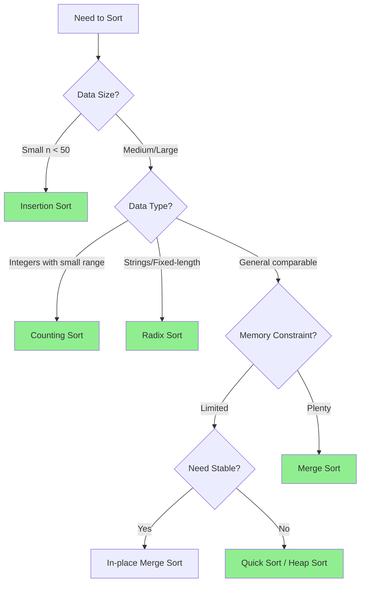

# 🔄 Sorting Algorithms

> **Category:** Core Algorithms  
> **Difficulty:** Beginner to Intermediate  
> **Prerequisites:** Arrays, Basic Complexity Analysis

---

## 📚 Overview

Sorting algorithms arrange elements of a list in a certain order (typically ascending or descending). They are fundamental to computer science and serve as building blocks for more complex algorithms.

### Why Sorting Matters

- **Search Optimization:** Binary search requires sorted data → O(log n) vs O(n)
- **Data Organization:** Databases, file systems, and indexes rely on sorted data
- **Algorithm Foundation:** Many algorithms assume sorted input (merge operations, finding duplicates)
- **Real-time Systems:** Efficient sorting is critical for responsive applications

---

## 📊 Classification

### By Comparison Method

```
Sorting Algorithms
├── Comparison-Based (Ω(n log n) lower bound)
│   ├── Exchange Sorts
│   │   ├── Bubble Sort
│   │   ├── Quick Sort
│   │   └── Cocktail Shaker Sort
│   ├── Selection Sorts
│   │   ├── Selection Sort
│   │   └── Heap Sort
│   ├── Insertion Sorts
│   │   ├── Insertion Sort
│   │   ├── Shell Sort
│   │   └── Binary Insertion Sort
│   └── Merge Sorts
│       ├── Merge Sort
│       └── Tim Sort
│
└── Non-Comparison (Can achieve O(n))
    ├── Counting Sort
    ├── Radix Sort
    └── Bucket Sort
```

### By Characteristics

| Characteristic | Description | Algorithms |
|---------------|-------------|------------|
| **Stable** | Equal elements maintain relative order | Merge, Insertion, Bubble, Counting |
| **In-place** | O(1) extra space | Quick, Heap, Insertion, Selection |
| **Adaptive** | Faster on partially sorted data | Insertion, Tim Sort, Bubble |
| **Online** | Can sort as data arrives | Insertion Sort |

---

## 📈 Complexity Comparison

### Comparison-Based Sorts

| Algorithm | Best | Average | Worst | Space | Stable | In-place |
|-----------|------|---------|-------|-------|--------|----------|
| [Bubble Sort](./comparison-sorts/bubble-sort.md) | O(n) | O(n²) | O(n²) | O(1) | ✅ | ✅ |
| [Selection Sort](./comparison-sorts/selection-sort.md) | O(n²) | O(n²) | O(n²) | O(1) | ❌ | ✅ |
| [Insertion Sort](./comparison-sorts/insertion-sort.md) | O(n) | O(n²) | O(n²) | O(1) | ✅ | ✅ |
| [Merge Sort](./comparison-sorts/merge-sort.md) | O(n log n) | O(n log n) | O(n log n) | O(n) | ✅ | ❌ |
| [Quick Sort](./comparison-sorts/quick-sort.md) | O(n log n) | O(n log n) | O(n²) | O(log n) | ❌ | ✅ |
| [Heap Sort](./comparison-sorts/heap-sort.md) | O(n log n) | O(n log n) | O(n log n) | O(1) | ❌ | ✅ |
| [Shell Sort](./comparison-sorts/shell-sort.md) | O(n log n) | O(n^1.5) | O(n²) | O(1) | ❌ | ✅ |

### Non-Comparison Sorts

| Algorithm | Time | Space | Constraints |
|-----------|------|-------|-------------|
| [Counting Sort](./non-comparison-sorts/counting-sort.md) | O(n + k) | O(k) | Integer keys, known range |
| [Radix Sort](./non-comparison-sorts/radix-sort.md) | O(d(n + k)) | O(n + k) | Fixed-length keys |
| [Bucket Sort](./non-comparison-sorts/bucket-sort.md) | O(n + k) | O(n) | Uniformly distributed |

### Hybrid Sorts

| Algorithm | Time | Space | Used By |
|-----------|------|-------|---------|
| [Tim Sort](./hybrid-sorts/tim-sort.md) | O(n log n) | O(n) | Python, Java |
| [Introspective Sort](./hybrid-sorts/introspective-sort.md) | O(n log n) | O(log n) | C++ STL |

---

## 🎯 Algorithm Selection Guide

### Decision Flowchart



### Quick Selection Table

| Scenario | Recommended | Why |
|----------|-------------|-----|
| Small arrays (n < 50) | Insertion Sort | Low overhead, cache-friendly |
| General purpose | Quick Sort | Fastest average case |
| Guaranteed O(n log n) | Merge Sort / Heap Sort | No worst-case degradation |
| Nearly sorted data | Insertion Sort / Tim Sort | Adaptive to existing order |
| Integers in small range | Counting Sort | O(n) time possible |
| Linked lists | Merge Sort | No random access needed |
| External sorting | Merge Sort | Sequential access pattern |
| Stability required | Merge Sort / Tim Sort | Preserves equal element order |
| Memory constrained | Heap Sort | O(1) extra space |

---

## 🔬 Mathematical Foundation

### Comparison-Based Lower Bound

**Theorem:** Any comparison-based sorting algorithm requires Ω(n log n) comparisons in the worst case.

**Proof Sketch:**
- There are n! possible permutations of n elements
- Each comparison provides 1 bit of information
- Need at least log₂(n!) bits to distinguish all permutations
- By Stirling's approximation: log₂(n!) ≈ n log₂(n) - n log₂(e) = Θ(n log n)

$$
\text{Minimum Comparisons} \geq \log_2(n!) = \Theta(n \log n)
$$

### Stability Definition

A sorting algorithm is **stable** if:

$$
\forall i, j: \text{if } a_i = a_j \text{ and } i < j \text{ in input, then } i < j \text{ in output}
$$

---

## 📁 Algorithms in This Section

### Comparison Sorts

| File | Algorithm | Status |
|------|-----------|--------|
| [bubble-sort.md](./comparison-sorts/bubble-sort.md) | Bubble Sort | 📋 Planned |
| [selection-sort.md](./comparison-sorts/selection-sort.md) | Selection Sort | 📋 Planned |
| [insertion-sort.md](./comparison-sorts/insertion-sort.md) | Insertion Sort | 📋 Planned |
| [merge-sort.md](./comparison-sorts/merge-sort.md) | Merge Sort | 📋 Planned |
| [quick-sort.md](./comparison-sorts/quick-sort.md) | Quick Sort | 📋 Planned |
| [heap-sort.md](./comparison-sorts/heap-sort.md) | Heap Sort | 📋 Planned |
| [shell-sort.md](./comparison-sorts/shell-sort.md) | Shell Sort | 📋 Planned |

### Non-Comparison Sorts

| File | Algorithm | Status |
|------|-----------|--------|
| [counting-sort.md](./non-comparison-sorts/counting-sort.md) | Counting Sort | 📋 Planned |
| [radix-sort.md](./non-comparison-sorts/radix-sort.md) | Radix Sort | 📋 Planned |
| [bucket-sort.md](./non-comparison-sorts/bucket-sort.md) | Bucket Sort | 📋 Planned |

### Hybrid Sorts

| File | Algorithm | Status |
|------|-----------|--------|
| [tim-sort.md](./hybrid-sorts/tim-sort.md) | Tim Sort | 📋 Planned |
| [introspective-sort.md](./hybrid-sorts/introspective-sort.md) | Introspective Sort | 📋 Planned |

---

## 🌍 Real-World Applications

| Application | Algorithm Used | Why |
|-------------|---------------|-----|
| Database indexing | B-tree insertion sort variants | Maintains sorted order |
| Java `Arrays.sort()` | Dual-Pivot QuickSort / TimSort | Best average performance |
| Python `sorted()` | TimSort | Optimized for real-world data |
| C++ `std::sort` | Introsort | Guaranteed O(n log n) |
| External sorting | Merge Sort | Sequential disk access |
| Graphics rendering | Radix Sort | Sorting by depth/color |

---

## 📖 References

1. Cormen, T. H., et al. *"Introduction to Algorithms"* (CLRS), Chapter 2, 6-8
2. Sedgewick, R. *"Algorithms"*, Part 2: Sorting
3. Knuth, D. E. *"The Art of Computer Programming"*, Volume 3: Sorting and Searching

---

[← Back to Main Index](../README.md)
