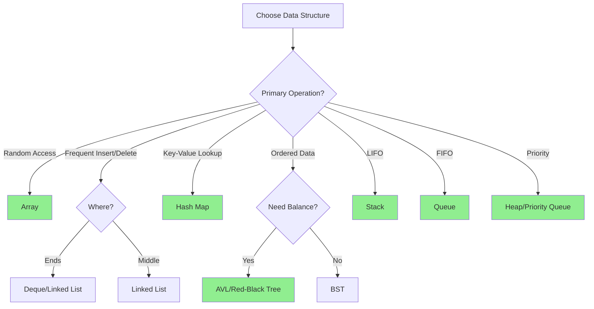

# 🏗️ Data Structures

> **Category:** Fundamental Computer Science  
> **Difficulty:** Beginner to Advanced  
> **Prerequisites:** Basic Programming, Arrays, Pointers/References

---

## 📚 Overview

Data structures are specialized formats for organizing, storing, and managing data. The choice of data structure significantly impacts algorithm efficiency and program performance.

### Why Data Structures Matter

- **Efficiency:** Right structure → Right complexity
- **Organization:** Logical data representation
- **Abstraction:** Hide implementation details
- **Reusability:** Standard interfaces and operations

---

## 📊 Classification

```
Data Structures
├── Linear
│   ├── Arrays
│   │   ├── Static Array
│   │   ├── Dynamic Array (ArrayList)
│   │   └── Circular Array
│   ├── Linked Lists
│   │   ├── Singly Linked List
│   │   ├── Doubly Linked List
│   │   └── Circular Linked List
│   ├── Stacks
│   │   ├── Array-based Stack
│   │   └── Linked List Stack
│   └── Queues
│       ├── Simple Queue
│       ├── Circular Queue
│       ├── Priority Queue
│       └── Deque
│
├── Trees
│   ├── Binary Trees
│   │   ├── Binary Search Tree (BST)
│   │   ├── AVL Tree
│   │   ├── Red-Black Tree
│   │   └── Splay Tree
│   ├── B-Trees
│   │   ├── B-Tree
│   │   └── B+ Tree
│   ├── Heaps
│   │   ├── Binary Heap (Min/Max)
│   │   ├── Fibonacci Heap
│   │   └── Binomial Heap
│   └── Specialized Trees
│       ├── Trie
│       ├── Segment Tree
│       ├── Fenwick Tree (BIT)
│       └── Suffix Tree
│
├── Graphs
│   ├── Adjacency Matrix
│   ├── Adjacency List
│   └── Edge List
│
├── Hash-Based
│   ├── Hash Table
│   ├── Hash Map
│   ├── Hash Set
│   └── Bloom Filter
│
└── Advanced
    ├── Disjoint Set (Union-Find)
    ├── Skip List
    └── LRU Cache
```

---

## 📈 Operations Complexity

### Linear Structures

| Structure | Access | Search | Insert | Delete | Space |
|-----------|--------|--------|--------|--------|-------|
| Array | O(1) | O(n) | O(n) | O(n) | O(n) |
| Dynamic Array | O(1) | O(n) | O(1)* | O(n) | O(n) |
| Singly Linked List | O(n) | O(n) | O(1) | O(1) | O(n) |
| Doubly Linked List | O(n) | O(n) | O(1) | O(1) | O(n) |
| Stack | O(n) | O(n) | O(1) | O(1) | O(n) |
| Queue | O(n) | O(n) | O(1) | O(1) | O(n) |

*Amortized

### Tree Structures

| Structure | Access | Search | Insert | Delete | Space |
|-----------|--------|--------|--------|--------|-------|
| BST (balanced) | O(log n) | O(log n) | O(log n) | O(log n) | O(n) |
| BST (worst) | O(n) | O(n) | O(n) | O(n) | O(n) |
| AVL Tree | O(log n) | O(log n) | O(log n) | O(log n) | O(n) |
| Red-Black Tree | O(log n) | O(log n) | O(log n) | O(log n) | O(n) |
| B-Tree | O(log n) | O(log n) | O(log n) | O(log n) | O(n) |
| Binary Heap | O(n) | O(n) | O(log n) | O(log n) | O(n) |
| Trie | O(m) | O(m) | O(m) | O(m) | O(ALPHABET × m × n) |

*m = key length

### Hash-Based Structures

| Structure | Search | Insert | Delete | Space |
|-----------|--------|--------|--------|-------|
| Hash Table (avg) | O(1) | O(1) | O(1) | O(n) |
| Hash Table (worst) | O(n) | O(n) | O(n) | O(n) |

---

## 🎯 Selection Guide



### Quick Selection Table

| Need | Best Choice | Why |
|------|-------------|-----|
| Fast random access | Array | O(1) index access |
| Fast insert at ends | Deque | O(1) both ends |
| Fast insert anywhere | Linked List | O(1) with reference |
| Fast key lookup | Hash Map | O(1) average |
| Sorted iteration | BST/TreeMap | In-order traversal |
| Priority ordering | Heap | O(log n) extract-min/max |
| Prefix matching | Trie | O(m) for key length m |
| Range queries | Segment Tree | O(log n) queries |
| Disk-based storage | B-Tree | Optimized for I/O |
| Memory-efficient set | Bloom Filter | Probabilistic membership |

---

## 📁 Structures in This Section

### [Linear](./linear/)

| File | Structure | Status |
|------|-----------|--------|
| [arrays.md](./linear/arrays.md) | Array Variants | 📋 Planned |
| [linked-lists.md](./linear/linked-lists.md) | Linked List Variants | 📋 Planned |
| [stacks.md](./linear/stacks.md) | Stack Implementations | 📋 Planned |
| [queues.md](./linear/queues.md) | Queue Variants | 📋 Planned |

### [Trees](./trees/)

| File | Structure | Status |
|------|-----------|--------|
| [binary-tree.md](./trees/binary-tree.md) | Binary Tree | 📋 Planned |
| [bst.md](./trees/bst.md) | Binary Search Tree | 📋 Planned |
| [avl-tree.md](./trees/avl-tree.md) | AVL Tree | 📋 Planned |
| [red-black-tree.md](./trees/red-black-tree.md) | Red-Black Tree | 📋 Planned |
| [b-tree.md](./trees/b-tree.md) | B-Tree | 📋 Planned |
| [trie.md](./trees/trie.md) | Trie (Prefix Tree) | 📋 Planned |
| [heap.md](./trees/heap.md) | Binary Heap | 📋 Planned |
| [segment-tree.md](./trees/segment-tree.md) | Segment Tree | 📋 Planned |

### [Graphs](./graphs/)

| File | Structure | Status |
|------|-----------|--------|
| [adjacency-matrix.md](./graphs/adjacency-matrix.md) | Adjacency Matrix | 📋 Planned |
| [adjacency-list.md](./graphs/adjacency-list.md) | Adjacency List | 📋 Planned |

### [Hashing](./hashing/)

| File | Structure | Status |
|------|-----------|--------|
| [hash-map.md](./hashing/hash-map.md) | Hash Map/Table | 📋 Planned |
| [bloom-filter.md](./hashing/bloom-filter.md) | Bloom Filter | 📋 Planned |

---

## 🌍 Real-World Applications

| Data Structure | Application | Example |
|----------------|-------------|---------|
| Array | Image pixels | Photoshop, GIMP |
| Stack | Undo functionality | Text editors |
| Queue | Task scheduling | OS process scheduler |
| Hash Map | Caching | Redis, Memcached |
| BST | Databases | MySQL indexes |
| B-Tree | File systems | NTFS, ext4 |
| Trie | Autocomplete | Google Search |
| Heap | Task schedulers | Linux CFS |
| Graph | Social networks | Facebook, LinkedIn |
| Bloom Filter | Spell checkers | Chrome, Medium |

---

## 📖 References

1. Cormen, T. H., et al. *"Introduction to Algorithms"* (CLRS)
2. Sedgewick, R. *"Algorithms"*, Parts 1-3
3. Weiss, M. A. *"Data Structures and Algorithm Analysis in Java"*

---

[← Back to Main Index](../README.md)
