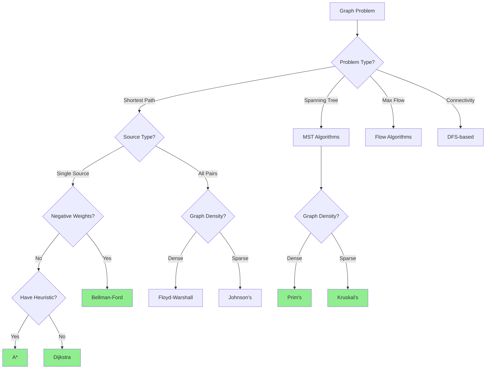

# 🕸️ Graph Algorithms

> **Category:** Advanced Algorithms  
> **Difficulty:** Intermediate to Advanced  
> **Prerequisites:** Graph Data Structures, BFS/DFS, Priority Queues

---

## 📚 Overview

Graph algorithms operate on graph data structures (vertices and edges) to solve problems like finding shortest paths, detecting cycles, determining connectivity, and optimizing network flows.

### Why Graph Algorithms Matter

- **Navigation:** GPS routing, network routing
- **Social Networks:** Friend recommendations, influence analysis
- **Resource Allocation:** Task scheduling, load balancing
- **Network Design:** Minimum cost networks, maximum flow

---

## 📊 Classification

```
Graph Algorithms
├── Traversal
│   ├── BFS (Breadth-First Search)
│   └── DFS (Depth-First Search)
│
├── Shortest Path
│   ├── Single Source
│   │   ├── Dijkstra (non-negative weights)
│   │   ├── Bellman-Ford (handles negative)
│   │   └── A* (heuristic-guided)
│   └── All Pairs
│       ├── Floyd-Warshall
│       └── Johnson's Algorithm
│
├── Minimum Spanning Tree
│   ├── Prim's Algorithm
│   ├── Kruskal's Algorithm
│   └── Boruvka's Algorithm
│
├── Network Flow
│   ├── Ford-Fulkerson Method
│   ├── Edmonds-Karp Algorithm
│   ├── Dinic's Algorithm
│   └── Push-Relabel
│
├── Connectivity
│   ├── Connected Components
│   ├── Strongly Connected Components (Kosaraju/Tarjan)
│   ├── Articulation Points
│   └── Bridges
│
├── Matching
│   ├── Bipartite Matching
│   ├── Hungarian Algorithm
│   └── Hopcroft-Karp
│
└── Special
    ├── Topological Sort
    ├── Cycle Detection
    ├── Graph Coloring
    └── Hamiltonian/Eulerian Paths
```

---

## 📈 Complexity Comparison

### Shortest Path Algorithms

| Algorithm | Time | Space | Negative Weights | Use Case |
|-----------|------|-------|------------------|----------|
| [Dijkstra](./shortest-path/dijkstra.md) | O((V+E)log V) | O(V) | ❌ | Single source, non-negative |
| [Bellman-Ford](./shortest-path/bellman-ford.md) | O(VE) | O(V) | ✅ | Single source, any weights |
| [Floyd-Warshall](./shortest-path/floyd-warshall.md) | O(V³) | O(V²) | ✅ | All pairs |
| [A*](./shortest-path/a-star.md) | O(E) | O(V) | ❌ | Single target with heuristic |
| Johnson | O(V² log V + VE) | O(V²) | ✅ | All pairs, sparse graphs |

### MST Algorithms

| Algorithm | Time | Space | Best For |
|-----------|------|-------|----------|
| [Prim](./spanning-tree/prim.md) | O(E log V) | O(V) | Dense graphs |
| [Kruskal](./spanning-tree/kruskal.md) | O(E log E) | O(V) | Sparse graphs |
| Boruvka | O(E log V) | O(V) | Parallel implementation |

### Network Flow

| Algorithm | Time | Space |
|-----------|------|-------|
| [Ford-Fulkerson](./flow/ford-fulkerson.md) | O(E × max_flow) | O(V) |
| [Edmonds-Karp](./flow/edmonds-karp.md) | O(VE²) | O(V) |
| Dinic | O(V²E) | O(V) |
| Push-Relabel | O(V²E) or O(V³) | O(V) |

---

## 🎯 Algorithm Selection Guide



---

## 🔬 Mathematical Foundation

### Graph Representation

**Adjacency Matrix:** $A[i][j] = w$ if edge $(i,j)$ exists with weight $w$
- Space: O(V²)
- Edge lookup: O(1)
- Best for: Dense graphs

**Adjacency List:** List of neighbors for each vertex
- Space: O(V + E)
- Edge lookup: O(degree)
- Best for: Sparse graphs

### Dijkstra's Correctness

**Invariant:** When vertex $v$ is extracted from priority queue, $d[v]$ = shortest path distance

$$
d[v] = \min_{(u,v) \in E} (d[u] + w(u,v))
$$

### MST Properties

**Cut Property:** For any cut, the minimum weight edge crossing the cut belongs to some MST.

$$
w(MST) = \sum_{e \in MST} w(e) \text{ is minimum}
$$

### Max Flow Min Cut Theorem

$$
\text{Maximum Flow} = \text{Minimum Cut Capacity}
$$

---

## 📁 Algorithms in This Section

### [Shortest Path](./shortest-path/)

| File | Algorithm | Status |
|------|-----------|--------|
| [dijkstra.md](./shortest-path/dijkstra.md) | Dijkstra's Algorithm | 📋 Planned |
| [bellman-ford.md](./shortest-path/bellman-ford.md) | Bellman-Ford | 📋 Planned |
| [floyd-warshall.md](./shortest-path/floyd-warshall.md) | Floyd-Warshall | 📋 Planned |
| [a-star.md](./shortest-path/a-star.md) | A* Search | 📋 Planned |

### [Spanning Tree](./spanning-tree/)

| File | Algorithm | Status |
|------|-----------|--------|
| [prim.md](./spanning-tree/prim.md) | Prim's Algorithm | 📋 Planned |
| [kruskal.md](./spanning-tree/kruskal.md) | Kruskal's Algorithm | 📋 Planned |

### [Network Flow](./flow/)

| File | Algorithm | Status |
|------|-----------|--------|
| [ford-fulkerson.md](./flow/ford-fulkerson.md) | Ford-Fulkerson | 📋 Planned |
| [edmonds-karp.md](./flow/edmonds-karp.md) | Edmonds-Karp | 📋 Planned |

---

## 🌍 Real-World Applications

| Algorithm | Application | Example |
|-----------|-------------|---------|
| Dijkstra | GPS Navigation | Google Maps, Waze |
| A* | Game AI Pathfinding | Video games, robotics |
| Bellman-Ford | Network routing | BGP protocol |
| Floyd-Warshall | Traffic analysis | City planning |
| Prim/Kruskal | Network design | ISP backbone |
| Max Flow | Airline scheduling | Resource allocation |
| Bipartite Matching | Job assignment | Task scheduling |
| Topological Sort | Build systems | Make, Gradle |

---

## 📖 References

1. Cormen, T. H., et al. *"Introduction to Algorithms"* (CLRS), Chapters 22-26
2. Sedgewick, R. *"Algorithms"*, Part 5: Graphs
3. Kleinberg, J. & Tardos, E. *"Algorithm Design"*, Chapters 3-7

---

[← Back to Main Index](../README.md)
