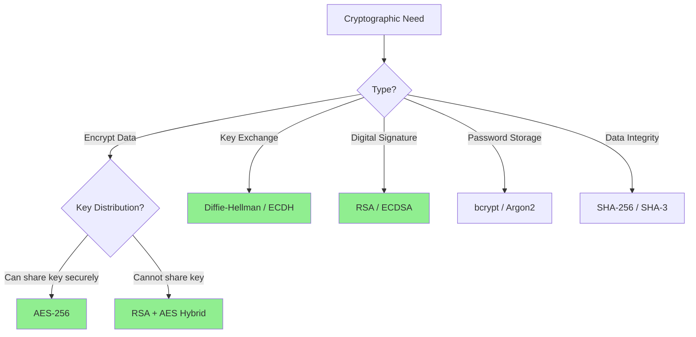

# 🔐 Cryptography Algorithms

> **Category:** Security & Encryption  
> **Difficulty:** Intermediate to Advanced  
> **Prerequisites:** Number Theory, Modular Arithmetic, Bit Manipulation

---

## 📚 Overview

Cryptographic algorithms transform readable data (plaintext) into unreadable format (ciphertext) and vice versa. They are essential for securing communications, protecting data, and ensuring authenticity.

### Core Principles

1. **Confidentiality:** Only authorized parties can read data
2. **Integrity:** Data hasn't been tampered with
3. **Authentication:** Verify identity of parties
4. **Non-repudiation:** Sender cannot deny sending

---

## 📊 Classification

```
Cryptographic Algorithms
├── Symmetric (Same key for encrypt/decrypt)
│   ├── Classical Ciphers
│   │   ├── Caesar Cipher
│   │   ├── Vigenère Cipher
│   │   ├── Playfair Cipher
│   │   └── Rail Fence Cipher
│   ├── Block Ciphers
│   │   ├── DES (Data Encryption Standard)
│   │   ├── AES (Advanced Encryption Standard)
│   │   └── Blowfish
│   └── Stream Ciphers
│       ├── RC4
│       └── ChaCha20
│
├── Asymmetric (Public/Private key pair)
│   ├── RSA
│   ├── Diffie-Hellman Key Exchange
│   ├── Elliptic Curve Cryptography (ECC)
│   └── ElGamal
│
├── Hash Functions
│   ├── MD5 (deprecated)
│   ├── SHA Family
│   └── bcrypt/scrypt
│
└── Digital Signatures
    ├── RSA Signatures
    ├── DSA
    └── ECDSA
```

---

## 📈 Comparison

### Symmetric Ciphers

| Algorithm | Key Size | Block Size | Security | Speed |
|-----------|----------|------------|----------|-------|
| [Caesar](./symmetric/caesar.md) | 1 byte | 1 byte | ❌ Weak | Very Fast |
| [Vigenère](./symmetric/vigenere.md) | Variable | 1 byte | ❌ Weak | Very Fast |
| [DES](./symmetric/des.md) | 56 bits | 64 bits | ❌ Deprecated | Fast |
| [3DES](./symmetric/3des.md) | 168 bits | 64 bits | ⚠️ Legacy | Slow |
| [AES-128](./symmetric/aes.md) | 128 bits | 128 bits | ✅ Strong | Fast |
| [AES-256](./symmetric/aes.md) | 256 bits | 128 bits | ✅ Very Strong | Fast |
| [Blowfish](./symmetric/blowfish.md) | 32-448 bits | 64 bits | ✅ Strong | Fast |

### Asymmetric Ciphers

| Algorithm | Key Size | Security | Use Case |
|-----------|----------|----------|----------|
| [RSA-2048](./asymmetric/rsa.md) | 2048 bits | ✅ Strong | Encryption, Signatures |
| [RSA-4096](./asymmetric/rsa.md) | 4096 bits | ✅ Very Strong | High security |
| [DH](./asymmetric/diffie-hellman.md) | 2048+ bits | ✅ Strong | Key Exchange |
| [ECC P-256](./asymmetric/ecc.md) | 256 bits | ✅ Strong | Mobile, IoT |

---

## 🔬 Mathematical Foundation

### Modular Arithmetic

$$
a \equiv b \pmod{n} \iff n | (a - b)
$$

**Caesar Cipher:**
$$
E(x) = (x + k) \mod 26
$$
$$
D(y) = (y - k) \mod 26
$$

### RSA Algorithm

**Key Generation:**
1. Choose primes $p, q$
2. Compute $n = pq$, $\phi(n) = (p-1)(q-1)$
3. Choose $e$ coprime to $\phi(n)$
4. Compute $d \equiv e^{-1} \pmod{\phi(n)}$

**Encryption/Decryption:**
$$
C = M^e \mod n
$$
$$
M = C^d \mod n
$$

### Diffie-Hellman Key Exchange

1. Public: prime $p$, generator $g$
2. Alice: secret $a$, sends $A = g^a \mod p$
3. Bob: secret $b$, sends $B = g^b \mod p$
4. Shared secret: $K = A^b = B^a = g^{ab} \mod p$

---

## 🎯 Selection Guide



### Quick Selection

| Need | Recommended | Why |
|------|-------------|-----|
| Encrypt files | AES-256-GCM | Fast, secure, authenticated |
| Secure communication | TLS (RSA/ECDHE + AES) | Industry standard |
| Password storage | bcrypt/Argon2 | Slow by design |
| Digital signatures | ECDSA P-256 | Small signatures |
| Key exchange | ECDH | Perfect forward secrecy |

---

## 📁 Algorithms in This Section

### [Symmetric](./symmetric/)

| File | Algorithm | Status |
|------|-----------|--------|
| [caesar.md](./symmetric/caesar.md) | Caesar Cipher | 📋 Planned |
| [vigenere.md](./symmetric/vigenere.md) | Vigenère Cipher | 📋 Planned |
| [des.md](./symmetric/des.md) | DES | 📋 Planned |
| [aes.md](./symmetric/aes.md) | AES | 📋 Planned |
| [blowfish.md](./symmetric/blowfish.md) | Blowfish | 📋 Planned |

### [Asymmetric](./asymmetric/)

| File | Algorithm | Status |
|------|-----------|--------|
| [rsa.md](./asymmetric/rsa.md) | RSA | 📋 Planned |
| [diffie-hellman.md](./asymmetric/diffie-hellman.md) | Diffie-Hellman | 📋 Planned |
| [ecc.md](./asymmetric/ecc.md) | Elliptic Curve | 📋 Planned |

---

## 🌍 Real-World Applications

| Application | Algorithms Used | Example |
|-------------|----------------|---------|
| HTTPS/TLS | RSA/ECDHE + AES + SHA | Web browsers |
| VPN | AES + HMAC | OpenVPN, WireGuard |
| Disk encryption | AES-XTS | BitLocker, FileVault |
| Password storage | bcrypt, Argon2 | Web applications |
| Cryptocurrency | ECDSA, SHA-256 | Bitcoin, Ethereum |
| Messaging | Signal Protocol | WhatsApp, Signal |

---

## ⚠️ Security Considerations

### Don'ts
- ❌ Don't implement crypto yourself in production
- ❌ Don't use MD5 or SHA-1 for security
- ❌ Don't use ECB mode for AES
- ❌ Don't use small key sizes (RSA < 2048)

### Do's
- ✅ Use established libraries (BouncyCastle, OpenSSL)
- ✅ Use authenticated encryption (AES-GCM)
- ✅ Use secure random number generators
- ✅ Keep libraries updated

---

## 📖 References

1. Schneier, B. *"Applied Cryptography"*
2. Stallings, W. *"Cryptography and Network Security"*
3. NIST Cryptographic Standards (SP 800 series)

---

[← Back to Main Index](../README.md)
