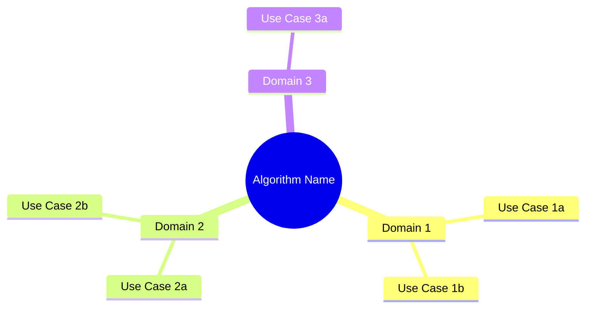
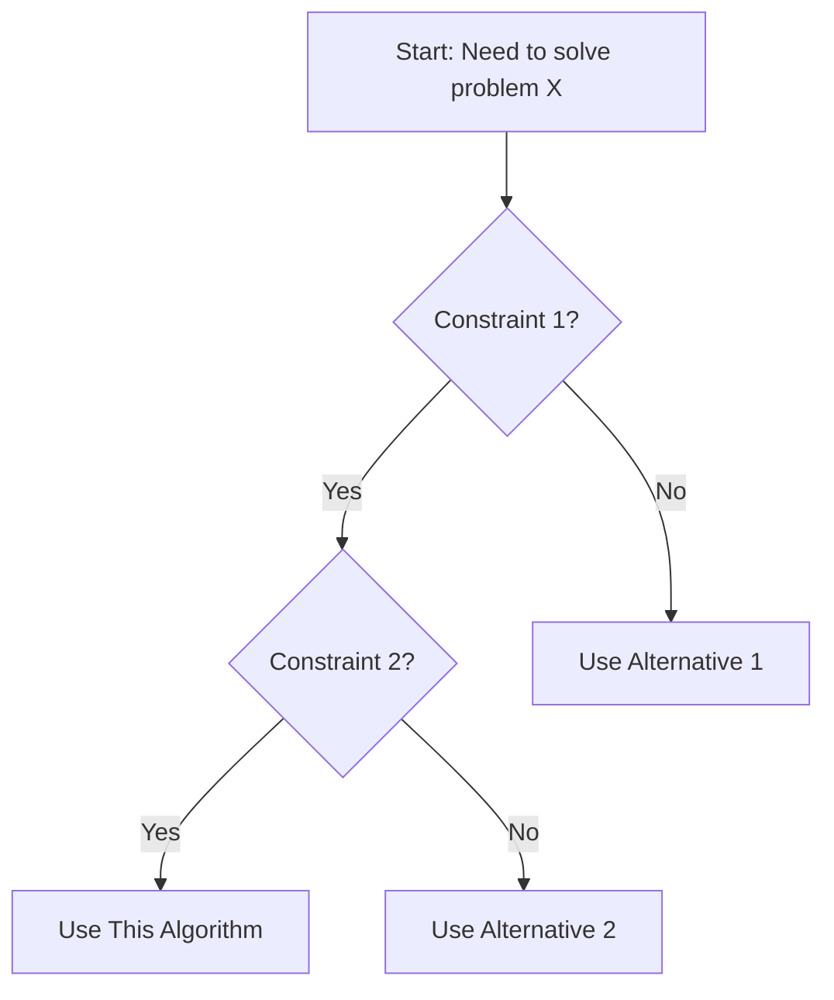

# [Algorithm Name]

> **Category:** [Category Name]  
> **Subcategory:** [Subcategory if applicable]  
> **Implementation:** [`ClassName.java`](../src/main/java/com/thealgorithms/[category]/ClassName.java)

---

## 📚 Overview

[Brief 2-3 sentence description of the algorithm. Explain what problem it solves and why it's important.]

**Key Characteristics:**
- [Characteristic 1]
- [Characteristic 2]
- [Characteristic 3]

---

## 🔢 Mathematical Foundation

### Definition

[Formal mathematical definition using proper notation]

> **Formal Definition:** Let $S$ be a set of $n$ elements...

### Key Properties

| Property | Description | Formula |
|----------|-------------|---------|
| Property 1 | [Description] | $formula$ |
| Property 2 | [Description] | $formula$ |

### Mathematical Formulation

The core mathematical concept can be expressed as:

$$
[LaTeX formula representing the core algorithm concept]
$$

**Where:**
- $n$ = [description]
- $k$ = [description]

### Recurrence Relation (if applicable)

$$
T(n) = \begin{cases}
O(1) & \text{if } n \leq 1 \\
aT(n/b) + f(n) & \text{otherwise}
\end{cases}
$$

### Proof of Correctness (optional)

**Loop Invariant / Induction Hypothesis:**

[Brief proof sketch using mathematical induction or loop invariants]

1. **Initialization:** [Proof that invariant holds before first iteration]
2. **Maintenance:** [Proof that if invariant holds before iteration, it holds after]
3. **Termination:** [Proof that algorithm terminates and invariant implies correctness]

---

## 📊 Complexity Analysis

### Time Complexity

| Case | Complexity | When it occurs |
|------|------------|----------------|
| **Best** | $O(?)$ | [Describe scenario] |
| **Average** | $O(?)$ | [Describe scenario] |
| **Worst** | $O(?)$ | [Describe scenario] |

### Space Complexity

| Type | Complexity | Notes |
|------|------------|-------|
| **Auxiliary Space** | $O(?)$ | [Additional memory needed] |
| **Total Space** | $O(?)$ | [Including input] |

### Additional Properties

| Property | Value |
|----------|-------|
| **In-place** | Yes / No |
| **Stable** | Yes / No |
| **Adaptive** | Yes / No |
| **Online** | Yes / No |

### Detailed Analysis

[Explain how the complexity is derived step by step]

**Time Complexity Derivation:**
```
Level 0: [work done]
Level 1: [work done]
...
Total: [summation]
```

---

## 🔄 Algorithm (Pseudocode)

```
ALGORITHM AlgorithmName(input)
─────────────────────────────────────────────────────
    INPUT:  [Description of input parameters]
    OUTPUT: [Description of what is returned/modified]
─────────────────────────────────────────────────────

    1. [Initialization step]
    2. [Step 2]
    3. FOR i ← 1 TO n DO
    4.     [Nested step]
    5.     IF condition THEN
    6.         [Action]
    7.     END IF
    8. END FOR
    9. RETURN result
```

### Step-by-Step Walkthrough

**Example Input:** `[sample input data]`

| Step | State | Action | Result |
|------|-------|--------|--------|
| 1 | Initial | [Action] | [State after] |
| 2 | [State] | [Action] | [State after] |
| 3 | [State] | [Action] | [State after] |
| ... | ... | ... | ... |

**Visual Representation:**

```
[ASCII art or diagram showing the algorithm progression]

Initial:  [5, 3, 8, 1, 2]
Step 1:   [3, 5, 8, 1, 2]  ← swapped 5 and 3
Step 2:   [3, 5, 8, 1, 2]  ← no swap needed
...
Final:    [1, 2, 3, 5, 8]
```

---

## 💻 Implementation Notes

### Java Implementation Highlights

```java
/**
 * Key implementation snippet (simplified for clarity)
 * 
 * @param input - description
 * @return description
 */
public ReturnType methodName(ParamType input) {
    // Key logic here
}
```

### Implementation Details

1. **[Detail 1]:** [Explanation]
2. **[Detail 2]:** [Explanation]
3. **[Detail 3]:** [Explanation]

### Code Reference

📁 **Source File:** [`src/main/java/com/thealgorithms/[category]/[FileName].java`](../src/main/java/com/thealgorithms/[category]/[FileName].java)

📁 **Test File:** [`src/test/java/com/thealgorithms/[category]/[FileName]Test.java`](../src/test/java/com/thealgorithms/[category]/[FileName]Test.java)

### Optimizations Applied

- [ ] [Optimization 1]
- [ ] [Optimization 2]
- [ ] [Optimization 3]

---

## 🌍 Real-World Applications in Software Engineering

### 1. [Application Domain 1]

**Use Case:** [Specific use case description]

**Example:** [Concrete example with context]

**Why This Algorithm:** [Explanation of why this algorithm is chosen over alternatives]

### 2. [Application Domain 2]

**Use Case:** [Specific use case description]

**Example:** [Concrete example with context]

**Why This Algorithm:** [Explanation]

### 3. [Application Domain 3]

**Use Case:** [Specific use case description]

**Example:** [Concrete example with context]

**Why This Algorithm:** [Explanation]

### Industry Examples

| Company/Product | Application | Scale |
|-----------------|-------------|-------|
| [Company 1] | [How they use this algorithm] | [Data size/throughput] |
| [Company 2] | [How they use this algorithm] | [Data size/throughput] |
| [Company 3] | [How they use this algorithm] | [Data size/throughput] |

### Common Use Cases Summary



---

## ⚖️ Comparison with Related Algorithms

### Comparison Table

| Aspect | This Algorithm | Alternative 1 | Alternative 2 |
|--------|----------------|---------------|---------------|
| **Time (Best)** | $O(?)$ | $O(?)$ | $O(?)$ |
| **Time (Average)** | $O(?)$ | $O(?)$ | $O(?)$ |
| **Time (Worst)** | $O(?)$ | $O(?)$ | $O(?)$ |
| **Space** | $O(?)$ | $O(?)$ | $O(?)$ |
| **Stable** | Yes/No | Yes/No | Yes/No |
| **In-place** | Yes/No | Yes/No | Yes/No |
| **Best For** | [Scenario] | [Scenario] | [Scenario] |

### When to Choose Each

| Choose This Algorithm When... | Choose Alternative When... |
|------------------------------|----------------------------|
| [Condition 1] | [Condition 1] |
| [Condition 2] | [Condition 2] |
| [Condition 3] | [Condition 3] |

### Decision Flowchart



---

## ⚠️ Common Pitfalls & Edge Cases

### Pitfalls to Avoid

| Pitfall | Description | Solution |
|---------|-------------|----------|
| **Pitfall 1** | [What can go wrong] | [How to avoid/fix] |
| **Pitfall 2** | [What can go wrong] | [How to avoid/fix] |
| **Pitfall 3** | [What can go wrong] | [How to avoid/fix] |

### Edge Cases

| Edge Case | Expected Behavior | Test |
|-----------|-------------------|------|
| Empty input | [Behavior] | ✅ Handled |
| Single element | [Behavior] | ✅ Handled |
| All identical elements | [Behavior] | ✅ Handled |
| Already optimal input | [Behavior] | ✅ Handled |
| Worst-case input | [Behavior] | ✅ Handled |
| Maximum size input | [Behavior] | ⚠️ Consider |

### Error Handling

```java
// Example of proper error handling
if (input == null) {
    throw new IllegalArgumentException("Input cannot be null");
}
if (input.length == 0) {
    return defaultValue; // or throw exception
}
```

---

## 🧪 Testing Recommendations

### Test Categories

1. **Unit Tests**
   - [ ] Basic functionality
   - [ ] Edge cases (empty, single element)
   - [ ] Boundary conditions

2. **Property-Based Tests**
   - [ ] [Property 1 to verify]
   - [ ] [Property 2 to verify]

3. **Performance Tests**
   - [ ] Benchmark with various input sizes
   - [ ] Memory usage profiling
   - [ ] Comparison with alternatives

### Sample Test Cases

```java
@Test
void testBasicCase() {
    // Arrange
    int[] input = {5, 3, 8, 1, 2};
    int[] expected = {1, 2, 3, 5, 8};
    
    // Act
    int[] result = algorithm.process(input);
    
    // Assert
    assertArrayEquals(expected, result);
}
```

---

## 📖 References

### Academic Sources

1. **[Author Name]** - *"Paper/Book Title"* (Year). [Link if available]
2. **[Author Name]** - *"Paper/Book Title"* (Year). [Link if available]

### Online Resources

1. [Resource Name](URL) - Brief description
2. [Resource Name](URL) - Brief description

### Implementation References

1. [Reference implementation or library](URL)
2. [Related implementation](URL)

---

## 🔗 Related Algorithms

### In This Repository

- [[Related Algorithm 1]](./related-algorithm-1.md) - Brief relation description
- [[Related Algorithm 2]](./related-algorithm-2.md) - Brief relation description

### Prerequisites

Before studying this algorithm, understand:
- [[Prerequisite Concept 1]](link)
- [[Prerequisite Concept 2]](link)

### Next Steps

After mastering this algorithm, explore:
- [[Advanced Algorithm 1]](link) - How it builds on this
- [[Advanced Algorithm 2]](link) - Related advanced topic

---

## 📝 Revision History

| Date | Author | Changes |
|------|--------|---------|
| YYYY-MM-DD | [Name] | Initial documentation |
| YYYY-MM-DD | [Name] | [What was updated] |

---

*Last updated: [Date]*

*Found an error or want to contribute? [Submit an issue](https://github.com/TheAlgorithms/Java/issues) or [create a pull request](https://github.com/TheAlgorithms/Java/pulls).*
